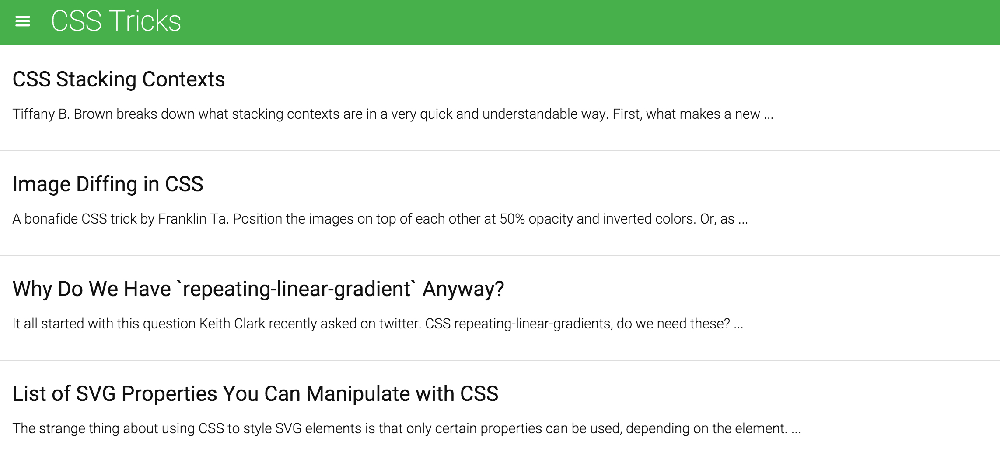
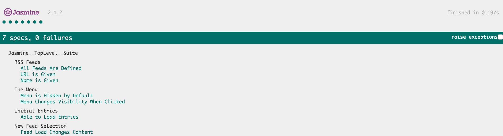

# Feedreader Testing with Jasmine

By: Yaz Khoury

## Description

Given an application for reading feeds and headlines in RSS, we must perform
a number of tests to ensure the application behaves as we expect.

> The application has been given by Udacity for the Front-End Developer Nanodegree

The following screenshot displays the application that we performed tests on:

The following screenshot displays the results of our test with jasmine:

To view the application and the test results, simply open index.html.

To view the test suites and tests performed, simply open jasmine/spec/feedreader.js

## Tests Performed

1. Ensure all feed variables are defined.
2. Ensure all feed url values are not empty.
3. Ensure all feed name values are not empty.
4. Ensure menu bar is hidden by default.
5. Ensure menu displays when clicked and disappears when clicked again.
6. Ensure feed entries are populated in the DOM upon performing asynchronous requests.
7. Ensure new feed entries are loaded upon making a new asynchronous request.

For contacting me, email me at: yaz.khoury@gmail.com
